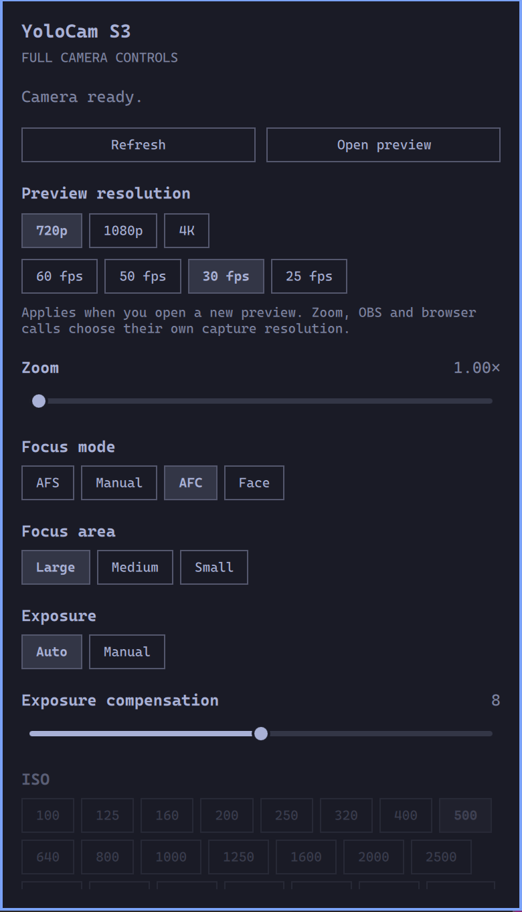

# YoloCam S3 for Omarchy

Control a YoloCam S3 from the Omarchy bar: autofocus, exposure, white balance,
zoom, image settings, and a local video preview with selectable resolution.



## Features

- Focus modes and focus area; automatic or manual exposure, compensation, ISO
  and shutter speed.
- White balance, brightness, contrast, saturation, sharpness, zoom,
  anti-flicker and HDR when the camera's native control connection is available.
- USB fallback for the standard controls the camera exposes through V4L2.
- Preview at 720p/1080p up to 60 fps, or 4K up to 30 fps. Choices come from the
  connected camera; the preview selection is remembered between sessions.
- Changes are read back from the camera before reporting success. Opening the
  panel reads settings without applying defaults.

## Requirements

- Omarchy Quattro with the Quickshell plugin API (`schemaVersion: 1`).
- YoloCam S3 connected by USB. Only USB vendor/product `46f8:0855` is supported.
- Python 3.10+, `uv`, `v4l-utils`, `mpv`, NetworkManager (`nmcli`) and `iproute2`.
  NetworkManager and iproute2 are normally already present in Omarchy.
- `protobuf==7.36.2`, installed into a dedicated user virtual environment by
  the setup command below. The standard USB fallback itself uses `v4l2-ctl`.

This is an independent community plugin, not an official YoloLiv product.

## Install

```bash
omarchy pkg add v4l-utils mpv uv
omarchy plugin add https://github.com/sud0n1m/omarchy-yolocam.git
bash ~/.config/omarchy/plugins/sudonim.yolocam/install.sh
omarchy plugin enable sudonim.yolocam --section right
```

Click the camera icon to open the panel. If the shell has cached an earlier
plugin error, run `omarchy restart shell` once.

The setup script installs only the Python dependency in
`~/.local/share/omarchy-yolocam/venv`. It does not enable the widget, copy files
over another installation, alter NetworkManager profiles, or apply camera
settings. Package installation and plugin enablement are explicit steps.

**Focus and exposure require the camera's USB network connection.** Configure
that interface for DHCP; see [USB network setup](docs/network.md). The camera's
address is discovered from its own DHCP server, rather than assuming a fixed
subnet. If that connection is unavailable, standard USB controls still work.

## Use

Sliders apply on release; buttons apply immediately. Arrow keys adjust a
focused slider, and Escape closes the panel. Refresh reads the latest settings.
Choose Manual exposure to enable ISO and shutter controls, or Manual white
balance to enable temperature. Camera settings affect video applications.

Choose a preview resolution and frame rate, then **Open preview**. A new mpv
window uses that selection; an already-open preview keeps its current format.
Close other applications using the camera before opening a preview, and close
the preview to release it. Resolution is negotiated by each capture application:
this setting does not force Zoom, OBS or browser calls to use the same format.

Manual focus mode is selectable, but manual lens-position adjustment is not
implemented. There is no camera power/privacy switch or automatic camera-setting
restoration. HDR and additional native image controls are exposed by the
upstream protocol; see the testing limits below.

## Data and permissions

The plugin runs as your desktop user and invokes local `v4l2-ctl`, `nmcli`,
`ip` and `mpv` commands. Native camera commands use TCP port 12345 on the S3's
own USB Ethernet link. The helper verifies USB identity and checks that the
DHCP server address belongs to that interface's subnet. Normal operation
does not modify network profiles, require root, or scan the LAN.

There is no telemetry, cloud service or video recording. Preview frames are
displayed locally. One preference file stores the preview mode:
`~/.local/state/omarchy/yolocam-preview.json` (or under `$XDG_STATE_HOME`).
A runtime lock serializes requests; requests have a bounded deadline.

## Update and remove

```bash
omarchy plugin update sudonim.yolocam
bash ~/.config/omarchy/plugins/sudonim.yolocam/install.sh
```

To remove:

```bash
omarchy plugin disable sudonim.yolocam
omarchy plugin remove sudonim.yolocam
```

Optional cleanup, after closing the preview:

```bash
rm -rf -- ~/.local/share/omarchy-yolocam/venv
rm -f -- "${XDG_STATE_HOME:-$HOME/.local/state}/omarchy/yolocam-preview.json"
```

Camera settings and any USB network profile you configured are left in place.

## Development and verification

```bash
python3 -B -m unittest discover -s .
omarchy plugin validate .
```

Install the pinned protobuf dependency to exercise tests with native protocol
imports. Ten tests cover control validation/readback, preview modes and
preferences, camera address discovery, and USB fallback.

Verified with an S3 on Omarchy on 2026-09-20: autofocus mode, exposure
compensation, manual exposure mode, ISO and shutter writes passed readback and
were restored; existing USB settings stayed unchanged. Two frames decoded at
each of 720p60, 1080p60 and 4K30. These are functional checks, not an image-quality
or sustained-streaming benchmark. Manual lens positioning is unsupported;
HDR and other native image-setting writes have not all been exercised.

Native settings/ranges can differ from the driver's cached UVC values. The
panel displays the active transport's readback without applying defaults.

## License and credits

GPL-3.0-or-later. See [LICENSE](LICENSE).

Camera protocol support comes from Seth Hillbrand's
[YoloCam Linux](https://gitlab.com/yolocam-linux/yolocam-linux).
The unmodified library source and its license are included under `vendor/`.
See [THIRD_PARTY_NOTICES.md](THIRD_PARTY_NOTICES.md) for the exact upstream
commit and attribution.
